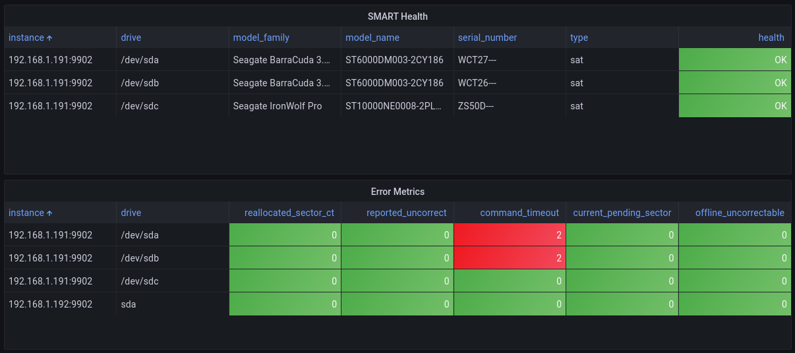
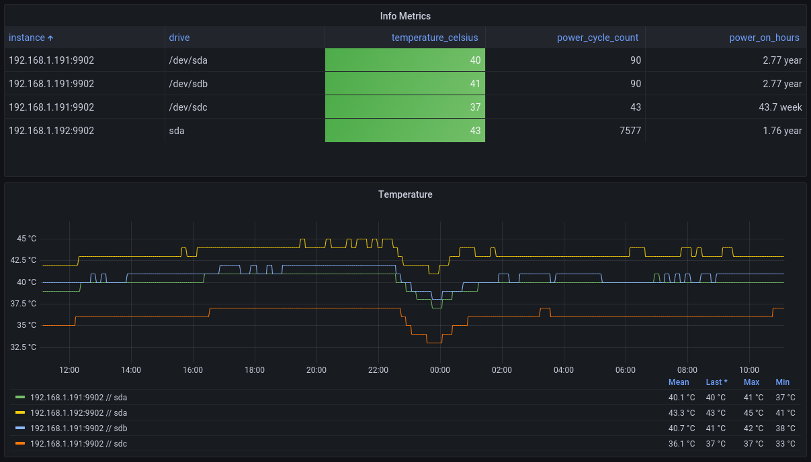

# Prometheus S.M.A.R.T ctl metrics exporter


This is a simple exporter for the [Prometheus metrics](https://prometheus.io/) using [smartctl](https://www.smartmontools.org/). The script `smartprom.py` also comes with `smartprom.service` so that you can run this script in the background on your Linux OS via `systemctl`. The script will use port `9902`, you can change it by changing it directly in the script. This script exports all of the data available from the smartctl.

## Install on server

You need python3 and pip. In addition you need to install prometheus client with `pip install prometheus-client`. To make it a easy replacement for the official smartctl exporter the smartprom.service is named smartctl_exporter and used port 9633 as an example.

Use smartctl version 7.3 or greater, if you have more than 105 scsi devices in your server. We recommend using version 7.3+ to see more data in grafana dashboards. The server grafana dashboard examples are made for smartctl version 7.4.

Newest version of smartctl can be obtained [here](https://builds.smartmontools.org/).

## Docker Install

_Note: You don't have to do this if you use the Docker image._

1. Copy the `smartprom.service` file into `/etc/systemd/system` folder.
2. Copy the `smartprom.py` file anywhere into your system.
3. Modify `ExecStart=` in the `smartprom.service` so that it points to `smartprom.py` in your system.
4. Run `chmod +x smartprom.py` 
5. Install `prometheus_client` for the root user, example: `sudo -H python3 -m pip install prometheus_client`
6. Run `systemctl enable smartprom` and `systemctl start smartprom`
7. Your metrics will now be available at `http://localhost:9902`

## Docker usage

No extra configuration needed, should work out of the box. The `privileged: true` is required in order for `smartctl` to be able to access drives from the host.

Docker image is here: <https://hub.docker.com/r/matusnovak/prometheus-smartctl>

The architectures supported by this image are: linux/386, linux/amd64, linux/arm/v6, linux/arm/v7, linux/arm64/v8, linux/ppc64le, linux/s390x

Example docker-compose.yml:

```yml
version: '3'
services:
  smartctl-exporter:
    image: matusnovak/prometheus-smartctl:latest
    container_name: smartctl-exporter
    privileged: true
    ports:
      - "9902:9902"
    restart: unless-stopped
```

Your metrics will be available at <http://localhost:9902/metrics>

The exported metrics looks like these:

```shell
smartprom_smart_passed{drive="/dev/sda",model_family="Seagate BarraCuda 3.5 (SMR)",model_name="ST6000DM003-2CY296",serial_number="WCT362XM",type="sat"} 1.0
smartprom_exit_code{drive="/dev/sda",model_family="Seagate BarraCuda 3.5 (SMR)",model_name="ST6000DM003-2CY296",serial_number="WCT362XM",type="sat"} 0.0
smartprom_raw_read_error_rate{drive="/dev/sda",model_family="Seagate BarraCuda 3.5 (SMR)",model_name="ST6000DM003-2CY296",serial_number="WCT362XM",type="sat"} 83.0
smartprom_raw_read_error_rate_raw{drive="/dev/sda",model_family="Seagate BarraCuda 3.5 (SMR)",model_name="ST6000DM003-2CY296",serial_number="WCT362XM",type="sat"} 2.23179896e+08
smartprom_power_on_hours{drive="/dev/sda",model_family="Seagate BarraCuda 3.5 (SMR)",model_name="ST6000DM003-2CY296",serial_number="WCT362XM",type="sat"} 73.0
smartprom_power_on_hours_raw{drive="/dev/sda",model_family="Seagate BarraCuda 3.5 (SMR)",model_name="ST6000DM003-2CY296",serial_number="WCT362XM",type="sat"} 24299.0
smartprom_airflow_temperature_cel{drive="/dev/sda",model_family="Seagate BarraCuda 3.5 (SMR)",model_name="ST6000DM003-2CY296",serial_number="WCT362XM",type="sat"} 60.0
smartprom_airflow_temperature_cel_raw{drive="/dev/sda",model_family="Seagate BarraCuda 3.5 (SMR)",model_name="ST6000DM003-2CY296",serial_number="WCT362XM",type="sat"} 40.0
...
```

## Configuration

Configuration can be done with environment variables.

- `SMARTCTL_REFRESH_INTERVAL`: (Optional) The refresh interval of the metrics. A larger value reduces CPU usage. The default is `60` seconds.
- `SMARTCTL_EXPORTER_PORT`: (Optional) The address the exporter should listen on. The default is `9902`.
- `SMARTCTL_EXPORTER_ADDRESS`: (Optional) The address the exporter should listen on. The default is to listen on all addresses.

In addition you can use program arguemnts. The following arguments can be set, all are optional:

- `web.listen-address`: The address to listen on. Default is 0.0.0.0.
- `web.listen-port`: The port to listen on. Default is 9902.
- `smartctl.interval`: Set update interval for polling scsi devices. Default is 60 seconds. If you have many devices consider setting it to 120 or above, to lower load on server.
- `ignore_sata`: Ignore all SATA drives. Default is to not ignore them.
- `show_mpath`: Connect SCSI device to multipath device name if you are using multipath. Default is not to do this.
- `connect_mpath_with_zpool`: Connect multipath device name to ZFS zpool name. Default is not to do this.
- `connect_mpath_to_part`: Connect multipath device name to ZFS pool paritition. Use this if any of your zpools are using parittions as device. Default is not to do this.
- `smartctl`: What smartctl command to use for this program. This is only used if you are not able to update the default smartctl program on server, beause of risk of breaking other monitoring tools. Default is not to use this.

See smarprom.service as an example of using above program arguments. In addition, you can use smartprom.py -h to see all program arguments. 

## Grafana dashboard

There is a reference Grafana dashboard in [grafana/grafana_dashboard.json](./grafana/grafana_dashboard.json).



